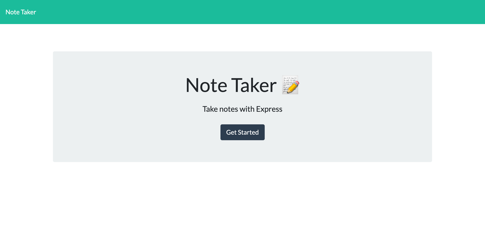
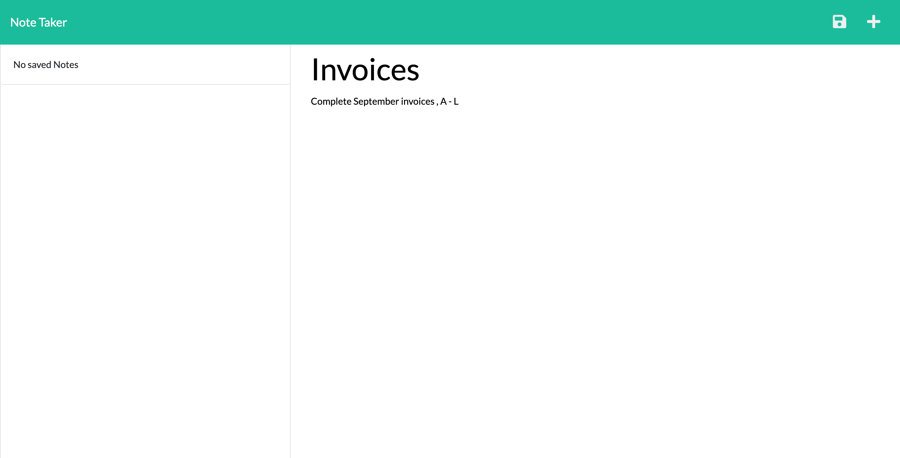
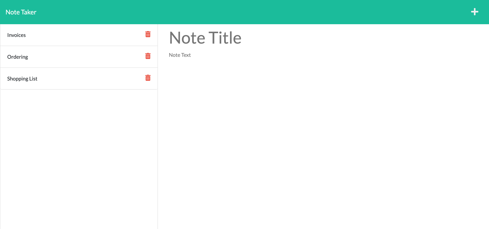

# Note Taker

## Table of Contents
* <a href="#description">Project Description</a>
* <a href="#technologies">Technologies</a>
* <a href="#demonstration">Demonstration </a>
* <a href="#link">Link </a>
* <a href="#contact">Contact</a>
* <a href="#future-improvements">Future Improvements</a>

 

## Description
The project is a simple note taker app. The user can create a new note (with a title, and body text), and save it to the application. Each note must contain both a title and body text, otherwise it cannot be saved. Saved notes are displayed on the sidebar. The user can access them at any time by simply clicking on an individual note. Notes can also be deleted by the user.

## Technologies:
* Node js
* Express.js
* IUD module

 

## Demonstration

The project can be run from the command line. The repository must be cloned to the user's machine, It can then be invoked using the command "node server.js" or "npm start".

Notes are stored as objects in the db.json file. Each note is stored with a title, body text, and a unique id.

 The functionality of the application can be seen in the screenshots below:
  
  

 
 

## Link
The note taker repository can be accessed at <a href="https://github.com/ekubik/note-taker" target="_blank"> https://github.com/ekubik/note-taker</a>

To view the deployed application, <a href="https://ancient-shelf-08932.herokuapp.com/" target="_blank"> click here </a>

 

## Contact
<a href="mailto:ewa.kubik@hotmail.com" > ewa.kubik@hotmail.com </a>

 

## Future Improvements
The project could be improved with the implementation of custom styling. Additionally, the code base could be made more readable by transferring the HTML routes from the server.js file, into their own htmlRoutes.js file, as was done with the API routes.
